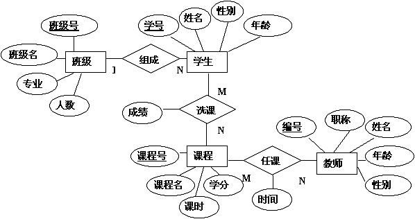

# 数据库与Django ORM

## 数据库(Database)

数据库就是存储数据的仓库，其本质是一个文件系统，数据按照特定的格式将数据存储起来，用户可以对数据库中的数据进行增加，修改，删除及查询操作。常见的关系型数据库(RDB)有:

* MySQL->MariaBD
* PostgreSQL
* SQLite/SQLite2/SQLite3
* Oracle
* SQLServer
* Access
* DB2
* SyBase

### 表(Table)

“表”就是人为地总结出来的、用以描述一类事物的一组描述信息。

#### 表名

类似于excel里面的sheet名称

#### 字段

类似于excel里面的列

#### 表举例

表定义:
| 字段 | 名称 | 类型 |
| --- | --- | --- |
| id | 用户ID | int |
| name | 姓名 | varchar(100) |
| sex | 性别 | varchar(2) |
| age | 年龄 | int |
| ... | ... | ... |

表数据:
| ID | 姓名 | 性别 | 年龄 |
| --- | --- |--- | --- |
| 1 | 张三 |男 | 20 |
| 2 | 李四 |男 | 30 |
| 3 | 王五 |女 | 20 |

### 约束

* 主键约束（Primay Key Coustraint） 唯一性，非空性

* 唯一约束 （Unique Counstraint）唯一性，可以空，但只能有一个

* 检查约束 （Check Counstraint）对该列数据的范围、格式的限制（如：年龄、性别等）

* 默认约束 （Default Counstraint）该数据的默认值

* 外键约束 （Foreign Key Counstraint）需要建立两表间的关系并引用主表的列

  

### 索引

  

  

  

### 实体-关系图(E-R图, Entity Relationship Diagram)

E-R图也称实体-联系图(Entity Relationship Diagram)，提供了表示实体类型、属性和联系的方法，用来描述现实世界的概念模型。它是描述现实世界关系概念模型的有效方法。是表示概念关系模型的一种方式。



### SQL

结构化查询语言（Structured Query Language）简称SQL，是一种特殊目的的编程语言，是一种数据库查询和程序设计语言，用于存取数据以及查询、更新和管理关系数据库系统。


#### SQL举例

```sql
-- sqlite3
-- 创建表
create table user
(
	id int
		constraint user_pk
			primary key,
	name char(100),
	sex char(2) default 男,
	age int
);

-- 插入数据
insert into user(`id`,`name`, `sex`, `age`) values (1, "张三", "男", 20);
insert into user(`id`,`name`, `sex`, `age`) values (2, "李四", "男", 30);
insert into user(`id`,`name`, `sex`, `age`) values (3, "王五", "女", 20);
insert into user(`id`,`name`, `sex`, `age`) values (4, "赵六", "女", 40);

-- 修改数据
update user set `age`=50 where `id`=4;

-- 删除数据
delete from user where `id`=4;

select * from user;	-- 查出所有用户
select * from user order by age desc;	-- 查出所有用户，按年龄逆序
select * from user order by age asc;	-- 查出所有用户，按年龄正序
select * from user order by age asc limit 1;	-- 查出所有用户，按年龄正序，取一个
select * from user order by age asc limit 1,1;	-- 查出所有用户，按年龄正序，跳第一个，并取第一个

select * from user where `sex`="男"; -- 查出所有男用户
select * from user where `sex`="男" and `age`=20; -- 查出所有男用户
select * from user where `age`>=20 and `age`<=25; -- 查出年龄在20到25范围
select * from user where `age` BETWEEN 20 AND 25; -- 同上
select `id` from user where `sex`="男"; -- 查出所有男用户的ID

select distinct `age` from user; -- 去重获取年龄

-- 聚合: 多多行数据进行运行运算
-- 聚合函数举例:

select count(`id`) as `ct` from user; -- 获取user表的记录数并命名为ct
select count(`id`) as `ct`, sum(age) as `sage`, avg(age) as `aage`, min(age) as `minage`, max(age) as `maxage` from user; -- 获取user表记录数、总年龄、平均年龄、最大年龄等

-- 分组聚合: 多多行数据进行分组之后再运算
-- 分组聚合举例:
select `age`, count('id') as ct from user group by age;	-- 获取个年龄段的用户数
select `sex`, `age`, count('id') as ct from user group by age, sex; -- 获取各性别年龄段的用户数

-- 删除全部数据
delete from user;
delete from user where `id` = 4;	-- 删除ID为4的用户


```


## 数据模型

简单讲，特定变成语言对数据库表的定义实现，在面向对象语言中一般与类的方式呈现。


## Python的ORM框架

* SQLAlchemy

  https://www.sqlalchemy.org/

* Django ORM

  https://docs.djangoproject.com/en/2.1/topics/db/models/


## Django ORM


### 模型定义


```python

class User(BaseModel):
    name = bfield.NormalTextField(_('姓名'))
    sex = bfield.NormalTextField(_('性别'))
    age = bfield.NormalTextField(_('年龄'))

    class Meta:
        verbose_name = _('用户')
        verbose_name_plural = _('用户')
        app_label = 'main'
        ordering = ['ordering', '-id']

    def __str__(self):
        return '%s %s %s' % (self.name, self.sex, self.age)


class Message(BaseModel):
    user = bfield.ForeignKey(verbose_name=_('用户'), to=User, null=True, on_delete=models.CASCADE)
    TAG_ORDER = 'order'
    TAG_SYSTEM = 'sytem'
    TAG_CHOICE = [
        (TAG_SYSTEM, '系统消息'),
        (TAG_ORDER, '订单消息'),
    ]
    TAG_MAP = dict(TAG_CHOICE)
    tag = bfield.NameField(_('分类'), db_index=True, choices=TAG_CHOICE, default=TAG_SYSTEM)
    isread = models.BooleanField(_('是否已读'), default=False)
    content = bfield.NormalTextField(_('正文'))

    class Meta:
        verbose_name = _('消息')
        verbose_name_plural = _('消息')
        app_label = 'main'
        ordering = ['-id']


class Order(BaseModel):
    user = bfield.ForeignKey(verbose_name=_('用户'), to=User, null=True, on_delete=models.CASCADE)
    date = models.DateTimeField(_('日期'))
    totalprice = bfield.DecimalField(_('订单金额'))

    class Meta:
        verbose_name = _('订单')
        verbose_name_plural = _('订单')
        app_label = 'main'
        ordering = ['-id']
```

### ORM查询举例

```python

from django.db.models.functions import ExtractMonth, ExtractDay, ExtractYear, TruncMonth, TruncDate, TruncYear, TruncMonth
from django.db.models import Q, Sum, Count, Max, Min, Avg

# 创建数据

User(name='张三', sex='男', age=20).save()
User(name='李四', sex='男', age=30).save()
User(name='王五', sex='女', age=20).save()
User(name='刘七', sex='女', age=25).save()

Message(user_id=1, tag=Message.TAG_SYSTEM, content='你好!').save()
Message(user_id=1, tag=Message.TAG_ORDER, content='你好!').save()
Message(user_id=1, tag=Message.TAG_ORDER, content='你好!').save()
Message(user_id=2, tag=Message.TAG_SYSTEM, content='你好!').save()

Order(user_id=1, date='2020-01-01', totalprice=100).save()
Order(user_id=2, date='2020-01-01', totalprice=200).save()
Order(user_id=2, date='2021-05-01', totalprice=600).save()
Order(user_id=3, date='2021-07-01', totalprice=785).save()
Order(user_id=4, date='2021-10-01', totalprice=1125).save()
Order(user_id=4, date='2021-12-01', totalprice=2500).save()


# 用户相关
print(User.objects.filter().all())  # 全部用户
print(User.objects.filter(age__range=[20, 25]))  # 获取年龄20到25的用户
print(User.objects.filter(Q(sex='男', age__gte=30) | Q(sex='女', age__gte=25)))  # 获取30岁以上男性或25岁以上女性
print(User.objects.filter().order_by('-age'))  # 年龄逆序
print(User.objects.filter().order_by('age'))  # 年龄正序
print(User.objects.filter().order_by('age')[1:2])
print(User.objects.filter().order_by().values('age'))  # 获取全部年龄，返回字典
print(User.objects.filter().order_by().values_list('age'))  # 获取全部年龄，返回列表
print(User.objects.filter().order_by().values_list('age', flat=True))  # 获取全部年龄，返回列表并压扁
print(User.objects.filter().count())  # 获取数量
print(User.objects.filter().aggregate(ct=Count('id'), sage=Avg('age'), minage=Min('age'), maxage=Max('age')))  # 聚合统计
print(User.objects.filter().values('age').order_by().annotate(ct=Count('id')))  # 按年龄分组
print(User.objects.filter().values('sex').order_by().annotate(ct=Count('id'), aage=Avg('age')))  # 按性别分组
print(User.objects.filter().values('sex', 'age').order_by().annotate(ct=Count('id')))  # 按性别、年龄分组

# 消息相关
print(Message.objects.filter(isread=False).count())  # 总未读消息数
print(Message.objects.filter(isread=False, user__sex='男').count())  # 男性用户未读消息数
print(Message.objects.filter(isread=False).values('user').order_by().annotate(ct=Count('id')))  # 用户未读消息数
print(Message.objects.filter(isread=False).values('user__age', 'tag').order_by().annotate(ct=Count('id')))  # 用户年龄、消息类型分组未读消息数

# 订单相关
# 按用户分组统计订单数、总金额、平均金额
print(Order.objects.filter().values('user').order_by().annotate(ct=Count('id'), sumprice=Sum('totalprice'), maxprice=Max('totalprice'), minprice=Min('totalprice'), avgprice=Avg('totalprice')))

# 按日期统计订单数、总金额、平均金额
print(Order.objects.filter().values('date').order_by().annotate(ct=Count('id'), sumprice=Sum('totalprice'), avgprice=Max('totalprice')))

# 去重获取交易日期
print(Order.objects.filter().order_by().values_list('date', flat=True).distinct())

# 去重获取交易年份
print(Order.objects.filter().order_by().values(year=ExtractYear('date')).values_list('year', flat=True).distinct())

# 按年份统计订单数、总金额、平均金额
print(Order.objects.filter().values(year=ExtractYear('date')).order_by().annotate(ct=Count('id'), sumprice=Sum('totalprice'), avgprice=Avg('totalprice')))

# 按年月统计订单数、总金额、平均金额
print(Order.objects.filter().values(datemonth=TruncMonth('date')).order_by().annotate(ct=Count('id'), sumprice=Sum('totalprice'), avgprice=Avg('totalprice')))

# 按月份统计订单数、总金额、平均金额
print(Order.objects.filter().values(month=ExtractMonth('date')).order_by().annotate(ct=Count('id'), sumprice=Sum('totalprice'), avgprice=Avg('totalprice')))


# 只更新指定字段
u = User.filter(id=1).first()
u.age = 30
u.save(update_fields=['age'])

# 联查
Order.objects.filter().select_related('user')

```


